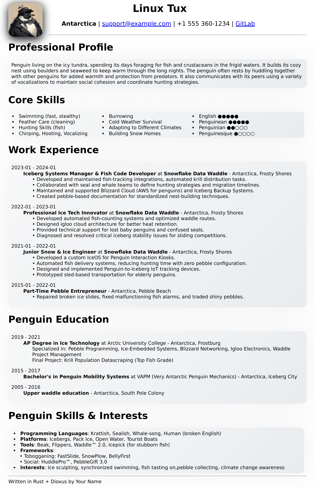

# Dioxus CV

Rust Dioxus is a modern web development framework for Rust that provides a declarative UI system and efficient rendering capabilities. It aims to simplify the process of building web applications with Rust, offering a syntax similar to React or Svelte while being compiled to high-performance WebAssembly (Wasm). The framework is designed to be easy to use and maintain, making it a popular choice for developers looking to build high-performing web apps in Rust.

Requirements:

- Rust
- Cargo
- dxcli

### Serving the App

Run the following command in the root of your project to start developing with the default platform:

```bash
dx serve
```

To run for a different platform, use the `--platform platform` flag. E.g.
```bash
dx serve --platform desktop
```

### Preview of generated CV


